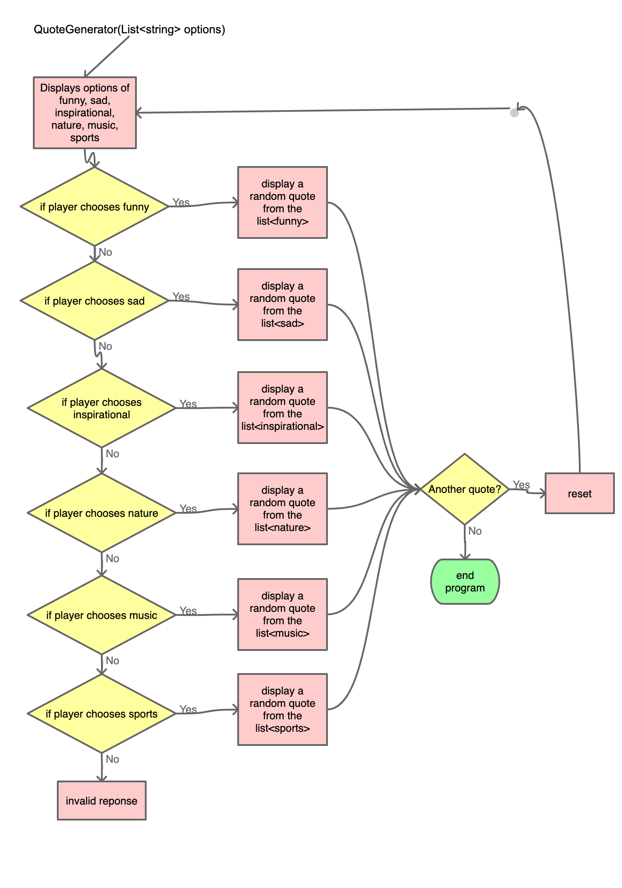

# QuoteGenerator

## Overview
Quote Generator displays a quote depending on what type of quote the player chooses. The player can choose from different catagories of quotes.

## Methods
I have broken down the program into 1 method:
- static List GenerateQuote(List<string> options);

## List GenerateQuote(List<string> options)
This method lets the player choose what type of quote they want and then displays a random quote that fits into that topic. 

1. Display the options Funny, Sad, Inspirational, Nature, Music, Sports
2. If funny is chosen
   - Display a random quote from the list<funny>
3. If Sad is chosen
   - Display a random quote from the list<sad>
4. If Inspirational is chosen
   - Display a random quote from the list<inspirational>
5. If Nature is chosen
   - Display a random quote from the list<nature>
6. If Music is chosen
   - Display a random quote from the list<music>
7. If Sports is chosen
   - Display a random quote from the list<sports>
8. Give the option for another quote, and if the player says "yes" reset and go back to step one. If the player says "no", end the program.